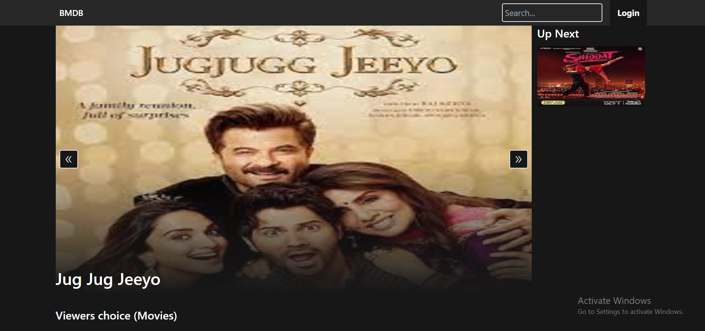
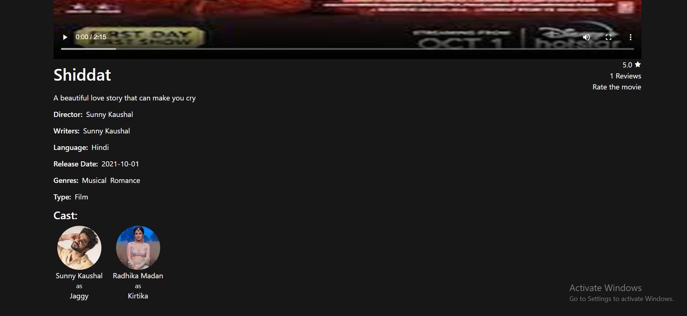
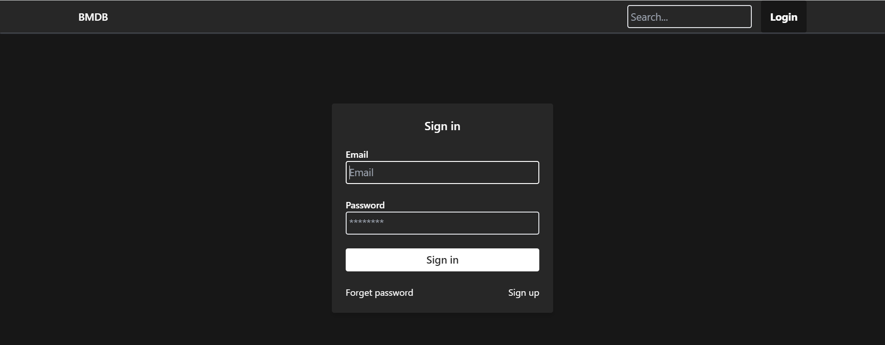
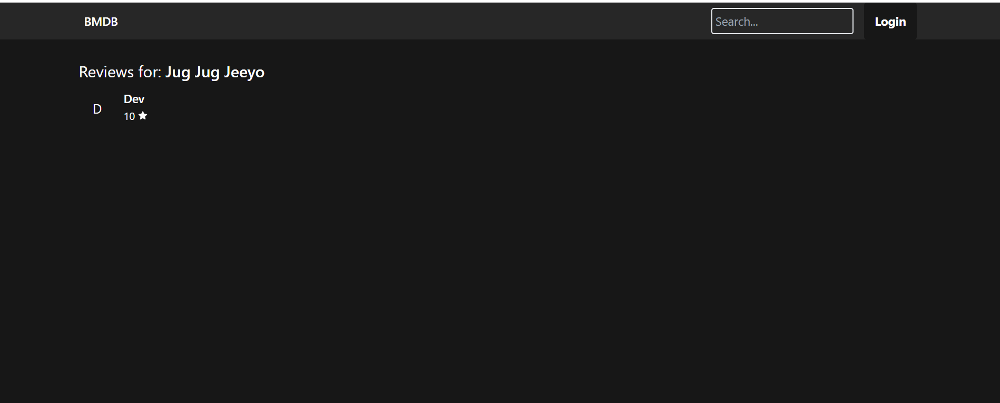
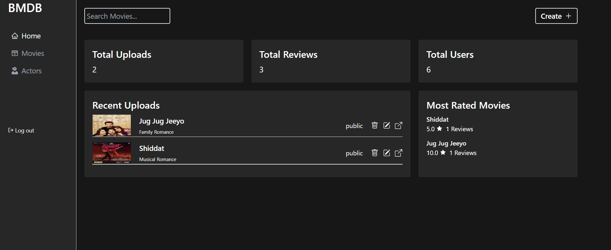
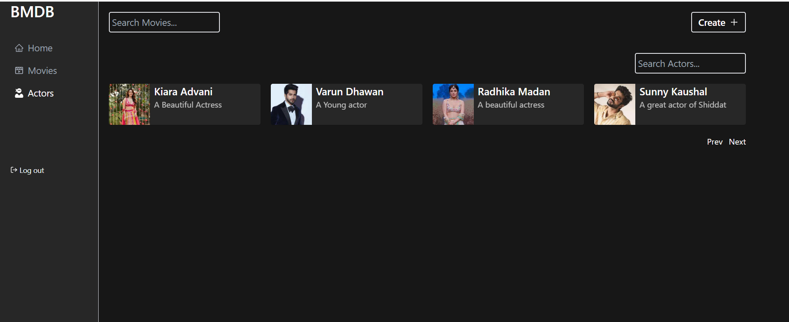
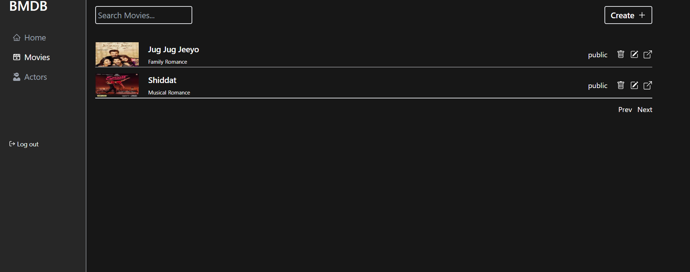

# BMDB

This is a web app having the bollywood movies , to which users can rate , review like they do in imdb. Users can also see the cast,trailers of the movie and also can view see the reviews of that movie.
This web app also has a layer of admin panel where users can add actors,trailers of the movie, see the other stats of the platform.

# Tech stacks used

* React.js
* Redux Toolkit
* Tailwind CSS
* Node.js
* Express.js
* MongoDB

# Screenshots of the project

